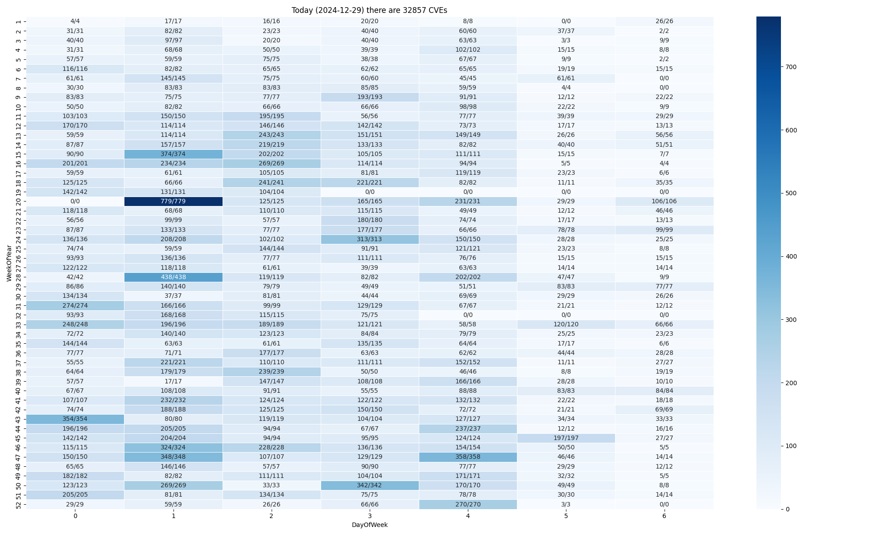
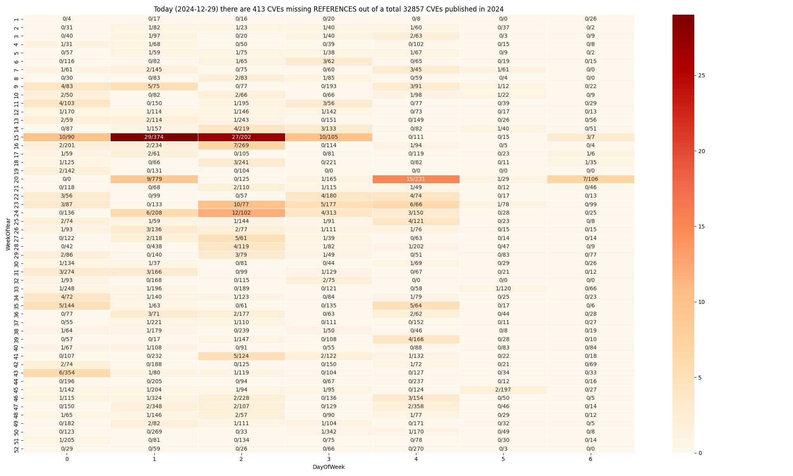
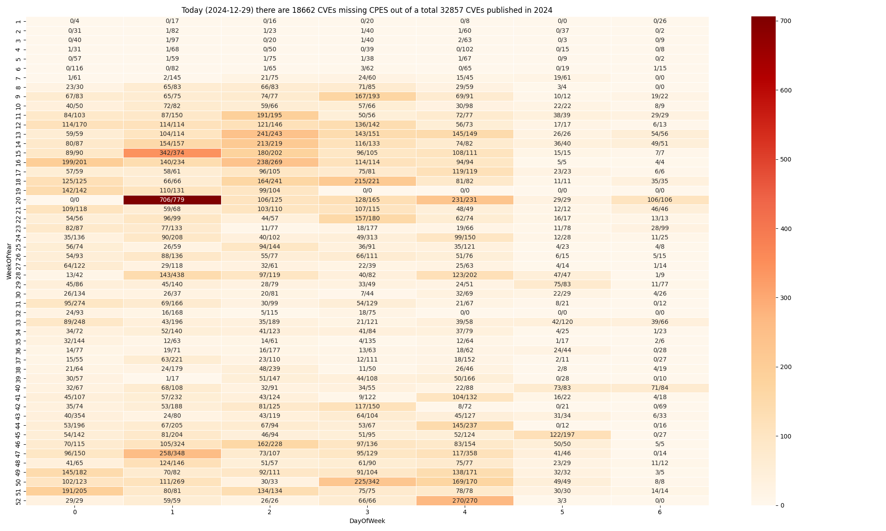
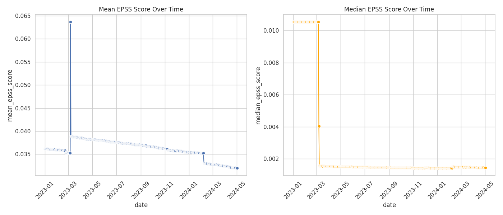

# CVE Analysis Dashboard 📊 - UPDATED DAILY

## Introduction

This project is dedicated to analyzing and visualizing Common Vulnerabilities and Exposures (CVE) data 🛡️. It focuses on identifying CVEs by their publication date, and whether they're missing Common Platform Enumerations (CPEs) or references.

## Features

- **Data Extraction**: Automatically downloads CVE data from the NVD feeds.
- **Data Processing**: Parses the JSON data to identify CVEs with/without CPEs and references.
- **Visualization**: Generates daily and weekly heatmap visualizations to provide insights at a glance.
- **Reporting**: Creates a detailed analysis report of CVE trends over time.

## Heatmaps 🔥

The generated heatmaps include:

1. **Total CVEs Per Day**: Shows the total count of new CVEs reported each day.
   
2. **CVEs Without References**: Indicates the number of CVEs lacking references on a daily basis.
   
3. **CVEs Without CPEs**: Highlights the daily CVEs that are missing CPEs.
   
4. **Median and Mean EPSS scores**: Monitor EPSS for changes overtime.
   
5. **EPSS for CISA KEV added after 2023**: Keeping track of EPSS on CISA KEV
   
5. **CVSS for CISA KEV added after 2023**: Keeping track of EPSS on CISA KEV
   


## Usage

To generate the heatmaps:

```bash
python generate_cve_heatmap.py
